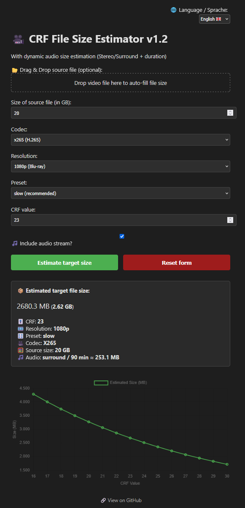

# 🎥 CRF File Size Estimator

A simple web-based tool to help estimate the final file size of an H.264 or H.265 encode based on CRF value, preset, resolution, and optional audio configuration.

Perfect for users of **HandBrake**, **FFmpeg**, or anyone working with `x264` or `x265` encoders.

> ⚠️ **Note:**
> All estimation results are **preliminary**.
> This JavaScript tool is a **conceptual prototype** and has **not yet been fully validated** yet.

---

## 🔧 Features of initial release 1.0

* Estimate target file size in **MB/GB** based on CRF efficiency
* Choose between `x264` and `x265` codecs
* Supports `slow` preset (currently fixed)
* Resolution presets: **1080p (Blu-ray)** and **576p (DVD)**
* Optional audio calculation:

  * Stereo (2.0) or Surround (5.1)
  * Runtime-based bitrate estimation
* Language switcher: **English 🇬🇧 / Deutsch 🇩🇪**
* Clean, responsive UI with a **Reset button**

---

## ✨ New in Version 1.1

* 📂 **Drag & Drop support** for video files
  → Automatically fills in the source file size based on the dropped file
* 🔁 **Improved Reset behavior**
  → Drag & Drop area now resets to its initial state

---

## 📊 New in Version 1.2

* **CRF impact chart**: Visualizes how file size changes across CRF values (16–30)

  * Uses the same estimation algorithm from the form
  * Helps users visually identify the best CRF for their target size
  * Updates live with your current configuration (codec, resolution, runtime, audio)
* 📈 Auto-displayed after each estimate
* 🧠 Especially helpful for learning how CRF compression behaves across encoders

---

## 🆕 New in Version 1.3

* ➕ **Optional source video bitrate input (kbit/s)**
  → More accurate estimates possible when the exact video bitrate of the source is known.
* 🕒 **Runtime moved out of the audio section**
  → Needed for bitrate-based estimation as well.
* 🧮 **Dual estimation method:**

  * If a source **video bitrate** is provided → bitrate-based calculation is used.
  * If only source **file size** is given → file size-based calculation (as before).
  * If both are given → consistency check between both methods, with warnings if they differ by more than 10%.
* 🎵 **Audio calculation unchanged** (Stereo 320 kbit/s / 5.1 384 kbit/s), but now clearly marked as separate from the video bitrate.
* ⚠️ **Validation & error messages improved** to prevent invalid input combinations.

---

## 🖼️ Screenshot

---

## 🚀 Getting Started

Download the HTML file from the repository or simply open it in your browser using this link:

👉 [Open CRF File Size Estimator](https://tooelite.github.io/crf-file-size-estimator/crf_file_size_estimator_v1.3.html)
